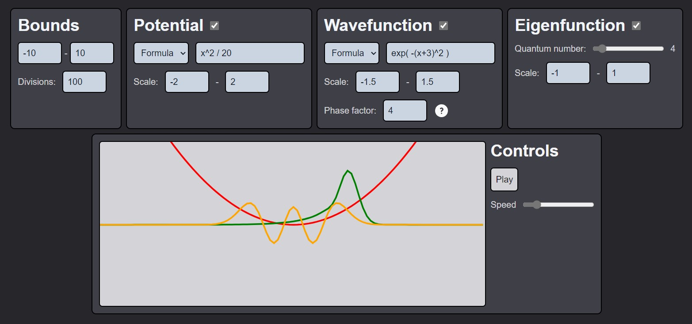

# qsim

An interactive solver for the Schrödinger equation in one dimension.

## How to use

- Download the [latest release](https://github.com/Zokalyx/qsim/releases/latest) and execute (no installation required)
- Executable works in Windows only (you can build the project yourself for another OS)

## Notes

- Built with Tauri and Sveltekit
